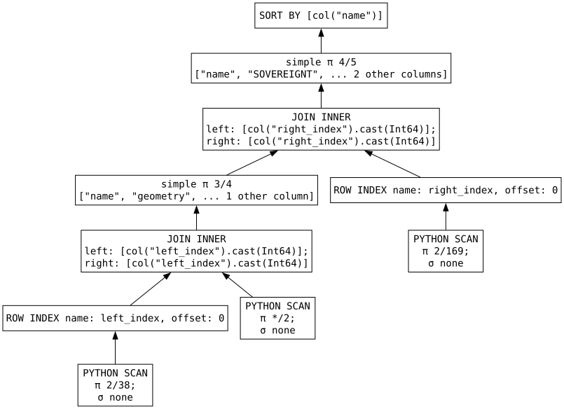

# Lazy Spatial Joins
When I initially started spatial polars, one of the things I really didn't like about what I had created was that it wasn't capable of doing a spatial join from a lazyframe.  I messed around with some attempts at registering a spatial lazyframe namespace/adding spatial join functionality to it. My original attempt involved collecting the data from the lazy frames within the join function.  The problem with that approach, is that it was collecting the query to build the spatial join's intermediate frame which joins the two input frames immediately, before the rest of the query was executed.  That defeated the entire idea of the lazy spatial join. Clearly, I wasn't going to go with that.  I knew there likely was a way to do what I wanted, but how to implement it evaded my thoughts until I bumped into the [pl.defer()](https://docs.pola.rs/api/python/stable/reference/api/polars.defer.html#polars.defer) function a few weeks ago.  Defer was [added to the polars API over a year ago](https://github.com/pola-rs/polars/pull/21685), I'm not sure if I missed it in the release notes when it got added, or if I simply didn't realize how useful it could/would be, but it's relatively new to me, and it's GREAT :boom:! 

## Tell me what you're planning, I'll do it later.
Defer, per the docs, `Takes a function that produces a DataFrame but defers execution until the
LazyFrame is collected`. It's absolutely perfect for what I needed!  Inside the lazyframe's join function, I have another function wrapped with defer which collects the geometries of the left and right frames, then builds out a STRtree, and transforms the results into an intermediate dataframe that is used to join the left and right frames together.  Because that joining frame is created by a function called with pl.defer, it doesn't get executed until the query is actually collected! lazy spatial join problem solved! well kinda... 

## What can't it do?
### Streaming from traditional GIS sources
So one of the really cool things about polars lazyframes and the streaming engine is it's ability to work with datasets that are bigger than the RAM on the box processing the query.  If you can't fit your data into RAM, this lazy spatial join still wont work, it needs to know all the geometries from both frames at the same time.  There's no spilling to disk or anything like that.  For the datasets I've worked with for the past 20+ years, that's not an issue, but if you've got super huge data you're working with, and/or limited RAM you're still out of luck here.  That's not an issue I run into much/ever, so I'm honestly not motivated to try to solve it(1).  I like being upfront and realistic :smile:.  That out of the way, I do like the idea of being able to use the polars streaming engine to write batches of data, so perhaps I'll try and figure it out at some point :thinking:(2).  Worth noting here, if your data is in parquet format, not a more "traditional" format (eg shapefiles, file geodatabase, geojson... stuff that spatial polars uses pyogrio to access) in my experimentation thus far, collecting queries which involve a lazy spatial join with the streaming engine works as expected.
{ .annotate }

1. Just being real :smile:, if you're in need of spatial ops on billions of rows, I doubt this will ever be the appropriate package
2. I think there's something going sideways between polars and pyogrio... 

## So what CAN it do?
Regular spatial joins, join nearest and centroid KNN joins are all now available for your spatial data processing delight.

The syntax for the joins are the same as for the normal dataframes, we'll just operate on lazyframes instead of dataframes:

```python title="Lazy Spatial Join" hl_lines="8-14"
--8<-- "spatial_join_lazy.py"
```

1. Scanning the lakes
2. Scanning the boundaries
3. Starting with the lake_df we'll start our spatial join
4. Specifying to join the lakes to this boundary_df
5. We'll use an inner join so as to only return rows for lakes that actually intersect a boundary.  If a lake does not intersect a boundary polygon we won't have a row for that lake in our output dataframe. Likewise, if a boundary doesn't intersect a lake, the resulting dataframe won't have a row for that boundary.

    !!! note
        This could have been left off, because `how='inner'` is the default

6. Use the 'intersects' spatial predicate so if any part of the lake shares any space with the boundary we'll join the lake to the boundary.  Since we've specified an inner join, if a lake intersects more than one boundary, we'll get more than one row for the lake since it's joined to more than one boundary.

    !!! note
        This could have been left off, because `predicate='intersects'` is the default

7. Since the name of the geometry struct is 'geometry' in both of our dataframes, we will use the `on` parameter, if we wanted to use a different column name for each of the dataframes we could use the `left_on` or `right_on` parameters. 

    !!! note
        This could have been left off, because `on='geometry'` is the default

8. Since we're joining the dataframes with a common column name (geometry), a suffix must be applied to the columns of the right dataframe that have names that exist in the left fram, because we can't have two columns with the same name.  we'll use "_boundary" as the suffix to clarify that the geometry of the right frame came from the boundaries dataframe.
9. Selecting the columns to make the lake name and SOVEREIGNT columns show up before the lake and boundary geometry columns.
10. Sort by the lake name just to make the results look nice in our output dataframe.
11. Note that "in-memory" engine.. streaming isn't working here for some reason.  not sure what's causing it, but in my testing thus far my python kernel crashes when I try to use the streaming engine.  I suspect something with pyogrio and polars aren't playing well together here, but haven't gotten to the root of the problem yet.

## Why lazy?
When we execute a lazy query, we gain the [optimizations](https://docs.pola.rs/user-guide/lazy/optimizations/) from the polars query engine.  In the example above, the lakes data has 39 columns, and the boundaries has 170.  The result of our query only returns two string columns, and the geometries from the lakes and the boundary. If we look at the graph for the query, we can see that polars sees that we only need a two columns from each of our sources!(1), so the query engine tells our io-plugin to only read the name/geometry from the lakes, and the SOVEREIGNT/geometry from the boundaries.  If we had to read all the columns from each of the source and then do our join and only keep a few fields at the end that's just wasting time/resources.
{ .annotate }

1. Note the PYTHON SCAN 2/38  and 2/169 boxes at the bottom of the graph indicating only two columns will be read from the sources.



## That's it for now
I really like building stuff, and I enjoy writing up blogs like this about the stuff I've created.  I do NOT like writing the end of them though.  Like, what do I write here?  I'm not trying to sell anything(1), I'm not necessarialy trying to get anyone to use this package(2), I don't have some sort of closing slogan(3).  I guess I'll just channel my high school English class informative writing coursework, and tell you what I've already told you.  Spatial polars can now do a spatial join from a lazyframe without the need to collect the query into a dataframe first! :partying_face: (4)
{ .annotate }

1. It's free.
2. I do think it's useful, and hopefully you do too! 
3. Ohhhh... maybe I need some sort of closing line like when [Matt O-Dowd ends episodes of spacetime with a cleverly worded sentence that ends with "Spacetime", and then the episode ends](https://www.pbs.org/show/pbs-space-time/), that'd be pretty rad, but I don't think I'm clever enough to pull off a lot of different ways of plugging "spatial polars" into the end of a sentence... 
4. High school english class didnt tell me anything about using emojis in my informative essays... because... well they didn't exist yet :laughing: :old_man: